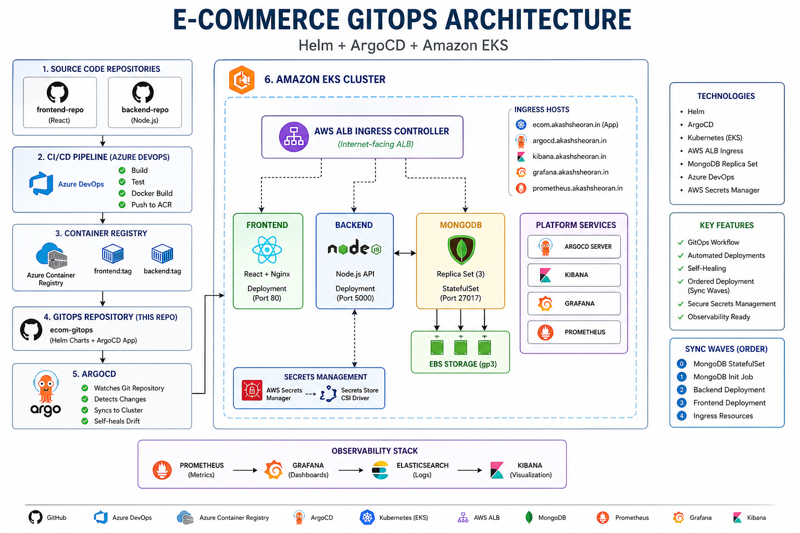

# 🚀 E-Commerce GitOps Repository (Helm + ArgoCD + EKS)

> Production-style GitOps repository for deploying a **cloud-native three-tier e-commerce application** on **Amazon EKS** using **Helm and ArgoCD**.

---

## 🌐 Overview

This repository contains the **deployment configuration (GitOps layer)** of a full-stack MERN e-commerce application.

It follows the **GitOps model**, where:

* Git is the **single source of truth**
* ArgoCD continuously syncs changes to Kubernetes
* Helm is used for templating and managing configurations

---

## 🏗️ Architecture

<p align="center">
  
</p>

<p align="center">
  <em>End-to-end GitOps deployment architecture using Helm, ArgoCD, and Amazon EKS</em>
</p>

```text
GitHub (GitOps Repo)
        ↓
ArgoCD (Continuous Delivery)
        ↓
Helm Chart (Templating Engine)
        ↓
Kubernetes Resources
        ↓
Amazon EKS Cluster
        ↓
AWS ALB Ingress
        ↓
Frontend (React + Nginx)
        ↓
Backend (Node.js API)
        ↓
MongoDB (StatefulSet Replica Set)
```

💡 **Explanation:**

* ArgoCD watches this repo and applies changes
* Helm converts templates into Kubernetes YAML
* ALB exposes the app to the internet
* Backend connects to MongoDB replica set

---

## 🧩 Repository Structure

```text
ecom-gitops/
├── helm/
│   ├── Chart.yaml
│   ├── values.yaml
│   └── templates/
│       ├── frontend/
│       ├── backend/
│       ├── database/
│       ├── ingress/
│       └── _helpers.tpl
│
└── argocd/
    └── ecom-app.yaml
```

* `helm/` → defines Kubernetes resources
* `values.yaml` → central configuration
* `templates/` → actual Kubernetes manifests
* `_helpers.tpl` → reusable naming/labels
* `argocd/` → tells ArgoCD how to deploy

---

## ⚙️ Tech Stack

| Layer         | Technology                       |
| ------------- | -------------------------------- |
| Packaging     | Helm                             |
| CD Tool       | ArgoCD                           |
| Orchestration | Kubernetes (EKS)                 |
| Ingress       | AWS ALB Ingress Controller       |
| Frontend      | React + Nginx                    |
| Backend       | Node.js (Express)                |
| Database      | MongoDB Replica Set              |
| Secrets       | AWS Secrets Manager + CSI Driver |

* Helm → templating
* ArgoCD → deployment automation
* EKS → infrastructure
* ALB → external traffic routing

---

## 🔄 GitOps Workflow

```text
Developer pushes code (CI updates image tag)
        ↓
GitOps repo is updated (values.yaml)
        ↓
ArgoCD detects change
        ↓
Syncs Helm chart to cluster
        ↓
Kubernetes resources updated automatically 🚀
```

---

## 🐳 Application Components

### 🟢 Frontend

* React app served via Nginx
* Handles UI and routing
* Health endpoint: `/health`

---

### 🔵 Backend

* Node.js Express API
* MongoDB connection with retry logic

Health endpoints:

* `/health/live` → container alive
* `/health/ready` → DB connected

💡 These endpoints are used by Kubernetes probes.

---

### 🟡 Database

* MongoDB StatefulSet (3 replicas)
* Replica set initialized via ArgoCD Job
* Persistent storage using EBS (gp3)

💡 StatefulSet ensures:

* stable pod names
* persistent storage
* ordered startup

---

## 🌐 Ingress Configuration

### 🔹 App Ingress

* Host: `ecom.akashsheoran.in`
* `/api` → Backend
* `/` → Frontend

💡 Unknown routes → frontend → React handles 404

---

### 🔹 Platform Ingress

* ArgoCD UI
* Kibana (logs)
* Grafana (metrics)
* Prometheus

💡 All share the same ALB using group annotations.

---

## 🧠 Deployment Strategy

Using ArgoCD **sync waves**:

```text
Wave 0 → MongoDB StatefulSet
Wave 1 → Replica Set Init Job
Wave 2 → Backend
Wave 3 → Frontend
Wave 4 → Ingress
```

💡 **Explanation:**
This ensures:

* DB is ready before backend
* backend is ready before frontend
* ingress comes last

---

## 🔐 Secrets Management

* AWS Secrets Manager
* Integrated using Secrets Store CSI Driver

💡 No secrets are stored in Git → secure approach

---

## ⚡ Key Features

* 🔥 GitOps-based deployment
* 🔁 Self-healing (ArgoCD)
* 🧠 Ordered deployment (sync waves)
* 🐳 Containerized microservices
* ☁️ Cloud-native architecture
* 📊 Observability ready
* 🔐 Secure secret handling

---

## 🚀 Deploy Using ArgoCD

```bash
kubectl apply -f argocd/ecom-app.yaml
```

💡 ArgoCD will:

* create namespace
* deploy Helm chart
* continuously sync changes